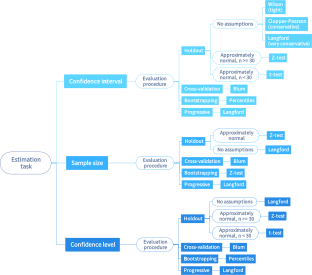

# confidence-planner

[](https://opensource.org/licenses/MIT)
[](https://www.python.org/downloads/)
[](https://github.com/dabrze/confidence-planner/actions/workflows/Tests.yml)
[](https://github.com/dabrze/confidence-planner/commits/)
[](https://github.com/dabrze/confidence-planner/discussions)

The **confidence-planner** package provides implementations of estimation procedures for confidence intervals 
around classification accuracy in Python. The package currently features approximations for holdout, bootstrap,
cross-validation, and progressive validation experiments. For information on how to install use the package, 
read on or take a look at our demonstration video below. To experiment with different estimation procedures go to the 
accompanying web application at https://prediction-confidence-planner.herokuapp.com/. 

## Installing confidence-planner

To install confidence-planner, just execute:

```bash
pip install confidence-planner
```

Afterwards you can import `confidence_planner` and use all its functions.

## Quickstart

```python
from sklearn import datasets, svm, metrics
from sklearn.model_selection import train_test_split
import confidence_planner as cp

# example dataset
X, y = datasets.load_breast_cancer(return_X_y=True)
X_train, X_test, y_train, y_test = train_test_split(
    X, y, test_size=0.3, stratify=y, random_state=23
)

# training the classifier and calculating accuracy
clf = svm.SVC(gamma=0.001)
clf.fit(X_train, y_train)
y_pred = clf.predict(X_test)
acc = metrics.accuracy_score(y_test, y_pred)

# confidence interval and sample size estimation
ci = cp.estimate_confidence_interval(y_test.shape[0], acc, confidence_level=0.90)
sample = cp.estimate_sample_size(interval_radius=0.05, confidence_level=0.90)
print(f"90% CI: {ci}")
print(f"Samples needed for a 0.05 radius 90% CI: {sample}")
```

More code examples (including cross-validation and bootstrapping) can be found in the `examples` folder.

## Methods



## References

Confidence-planner methods belong to the field of frequentist statistics.

[1] Langford, J.: Tutorial on practical prediction theory for classification. 
Journal of Machine Learnining Research 6, 273–306 (2005).

[2] Blum, A., Kalai, A., Langford, J.: Beating the hold-out: Bounds for k-fold and progressive cross-validation. 
Proceedings of the Twelfth Annual Conference on Computational Learning Theory, COLT (1999).

[3] Puth, M.T., Neuhauser, M., Ruxton, G.: On the variety of methods for calculating confidence intervals by bootstrapping. 
The Journal of animal ecology 84 (2015).

## License 

Confidence-planner is free and open-source software licensed under the [MIT license](https://opensource.org/licenses/MIT).

## Contact

The best way to ask questions is via the [GitHub Discussions channel](https://github.com/dabrze/confidence-planner/discussions). 
In case you encounter usage bugs, please don't hesitate to use the [GitHub's issue tracker](https://github.com/dabrze/confidence-planner/issues) directly. 
